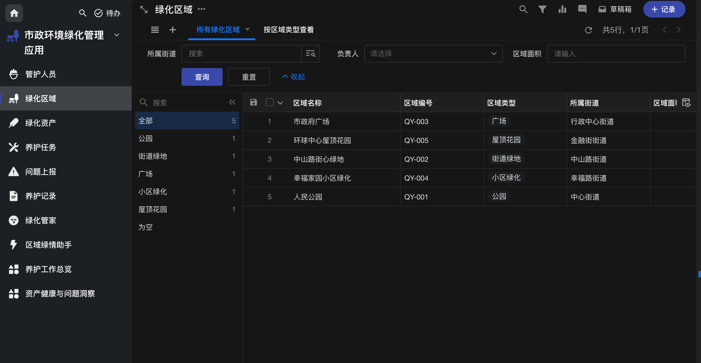
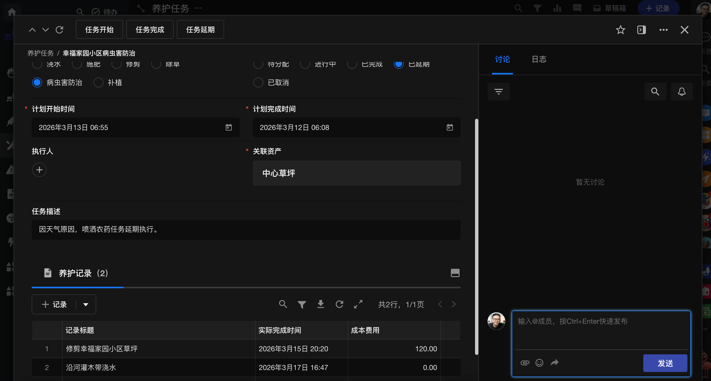
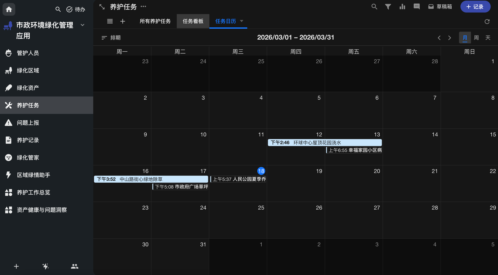
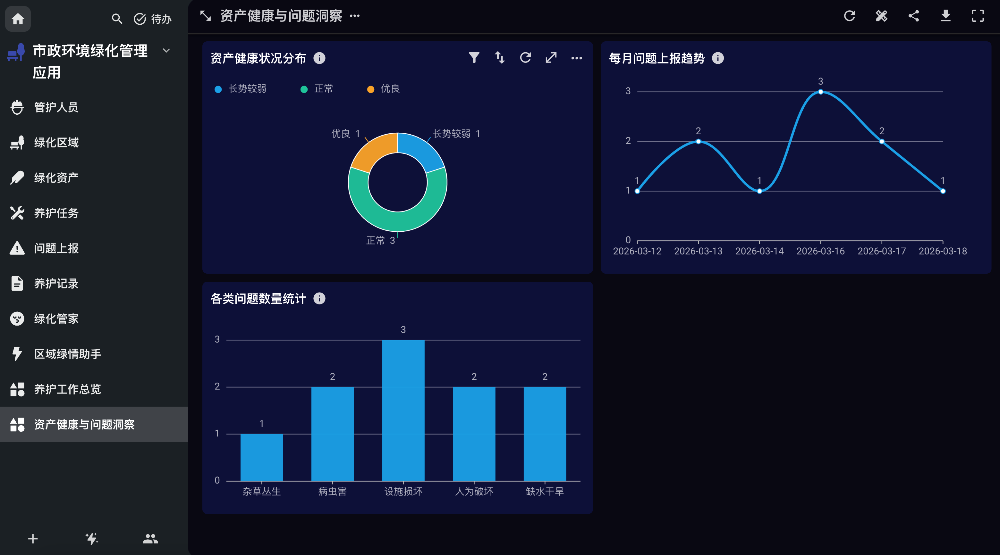
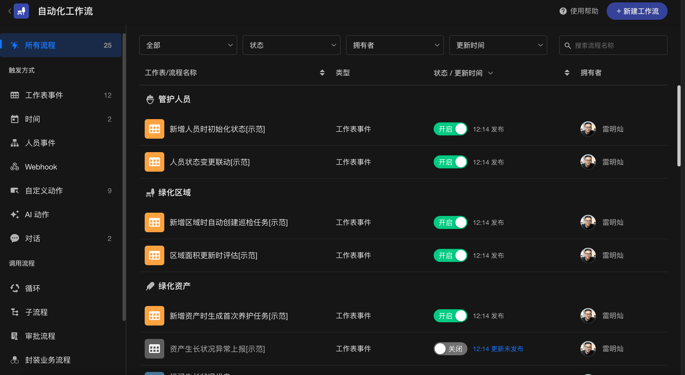
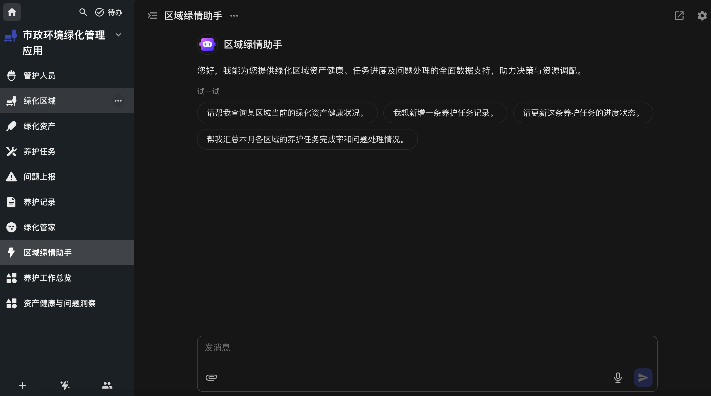
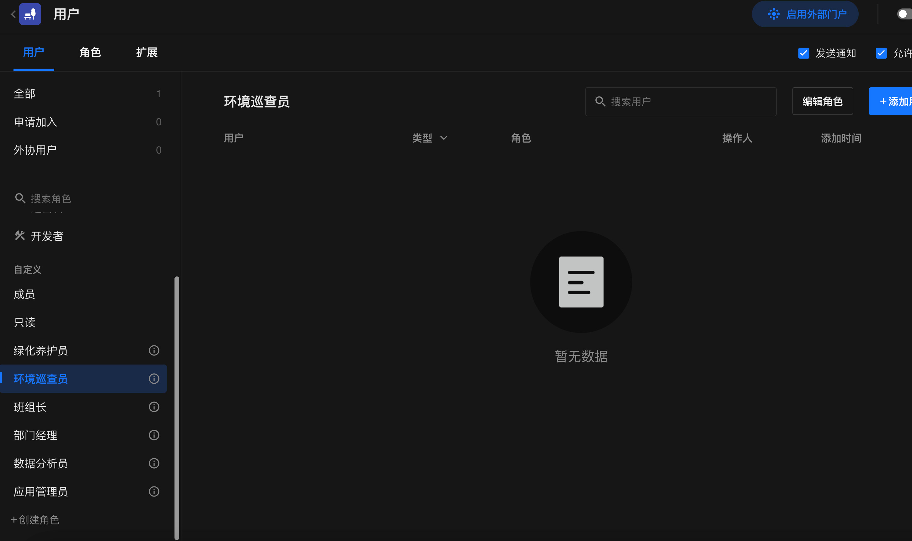

# HAP Auto Maker

基于 Gemini + HAP自动化应用搭建助手。
通过自然语言对话，全自动完成：**创建应用 → 建立工作表及字段 → 配置视图 → 构造测试数据 → 生成智能机器人** 的完整开发工作流。

## 🎬 核心特性
- **对话即开发**：描述需求即可，AI 自动转换为明道云的建表结构与字段关联。
- **真实数据生成**：根据表结构自动生成符合业务逻辑的测试数据。
- **完全自动化**：一键调用 Gemini 与内部接口，无需人工干预。

---

## 🛠️ 自动化搭建能力矩阵

目前 HAP Auto Maker 拥有针对 HAP 应用搭建周期内的全阶段支持，能够全自动构建以下核心组件：

- **📦 基础应用创建**：根据需求自动生成应用实例，并包含主色调定制。
- **📋 工作表与字段编排**：支持文本、数值、日期、人员、单选多选及关联记录等几十种复杂字段的识别与创建。

  
  

- **🎨 智能图标 (Icon) 匹配**：针对应用整体及下属每一张工作表，通过大模型语义分析自动挑选并匹配最符合业务场景的矢量图标。
- **🖼️ 视图个性化配置**：自动识别应用场景并配置列表视图、看版视图、画廊视图等，自动植入筛选与排序规则。

  

- **📊 统计图表**：自动围绕业务数据生成饼图、柱状图、折线图等数据分析界面，直观展示业务指标。

  

- **⚙️ 自动化工作流**：无需手动画布，自动判断业务需求创建工作表记录触发、定时触发引擎，甚至一键追加更新字段、发送通知等执行动作节点。

  

- **🤖 智能问答机器人**：一键绑定相关业务库并快速部署智能 AI 客服通道。

  

- **🎭 角色与权限**：规划并建立“管理员”、“普通员工”、“审批人”等角色权限体系。

  

- **🎲 Mock 数据自动化**：打破空应用没法体验的窘境，依据当前字段条件智能注入带有真实语境的测试数据集。

---

## 🚀 快速开始

### 1. 前置检查
- 操作系统：**macOS**
- Python 环境：**Python 3.11 或 3.12**（低于 3.11 将导致运行失败！[点此下载 3.12 官方安装包](https://www.python.org/ftp/python/3.12.9/python-3.12.9-macos11.pkg)）
- 权限说明：需提供一个具有**明道云组织管理员**权限的账号。

### 2. 克隆与初始化
```bash
git clone https://github.com/andyleimc-source/auto_hap.git
cd auto_hap

# 运行一键初始化（自动安装依赖、引导配置密钥）
python3 setup.py
```
> 💡 **小贴士**：未来如果需要更换账号或更新了项目，随时可以运行 `python3 setup.py --force` 重新初始化。

### 3. 一键构建应用 ✨
所有配置完成后，直接通过以下命令与 HAP Auto 对话并自动创建应用：
```bash
python3 scripts/run_app_pipeline.py
```
> 根据终端提示输入你的应用需求，最后输入「**开始运行**」，剩下的交给 AI 去完成！

---

## 🔑 密钥获取指南

在运行 `setup.py` 时，需要填写以下信息。为了顺畅体验，建议提前准备：

| 参数名称 | 用途 | 获取方式 |
|---|---|---|
| **Gemini API Key** | AI 大脑，负责需求理解、架构规划和数据生成 | 前往 [Google AI Studio](https://aistudio.google.com/apikey) 申请 |
| **app_key** / **secret_key** | 用于调用明道云 OpenAPI | 组织管理 → 集成 → 其他 → 开放接口 → 密钥<br> （`https://www.mingdao.com/admin/integrationothers/你的组织ID`） |
| **project_id** (组织 ID) | 指定应用所属组织 | 组织管理 → 组织 → 组织信息 → 编号（ID） |
| **owner_id** (拥有者) | 指定应用拥有者 | 进入明道云，点击群聊中的个人头像，浏览器地址栏中 `user_xxx` 的 `xxx` 部分 |
| **group_ids** (分组 ID) | [*可选*] 应用创建后的所在分组 | 点击某个应用分组，地址栏中 `groupId=xxx` 的 `xxx` 即是 |
| **登录账号/密码** | 自动登录并获取网页端凭证 | 提供你有明道云**组织管理员**权限的登录账号 |

---

## ⚠️ 声明

本项目基于作者个人兴趣开发。所有功能实现依赖于 HAP 的公开 API 以及部分浏览器接口抓包分析。
> **注意**：如果未来前端内部接口发生变动，可能会导致项目中部分自动化功能无法运行。遇到此情况时，可能需要重新调试或等待作者更新代码。

**如有任何问题或交流需求，欢迎联系作者微信：`houbaole`**


